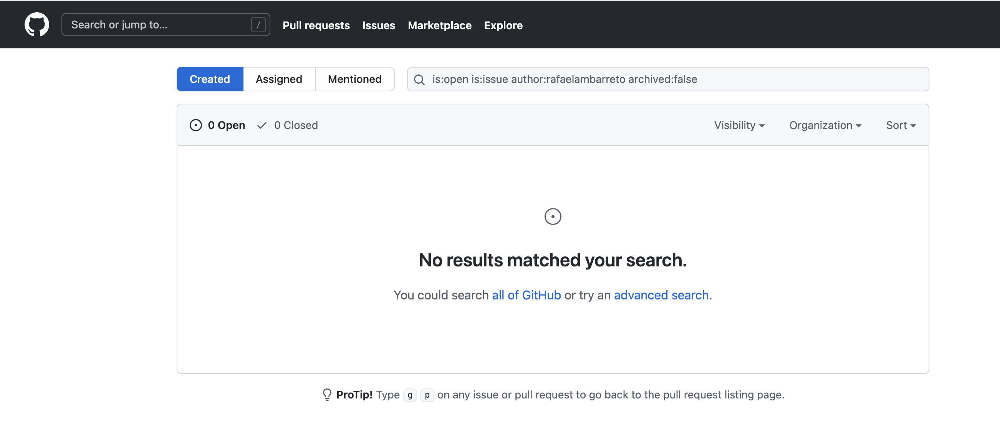
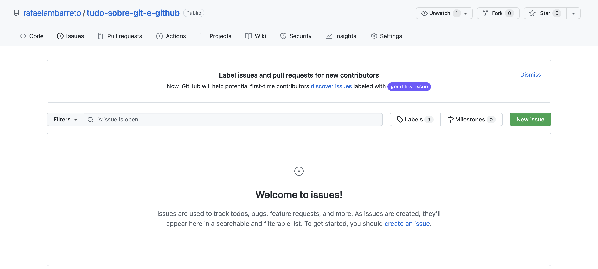
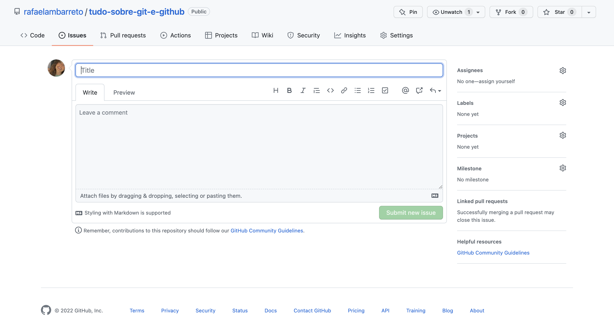
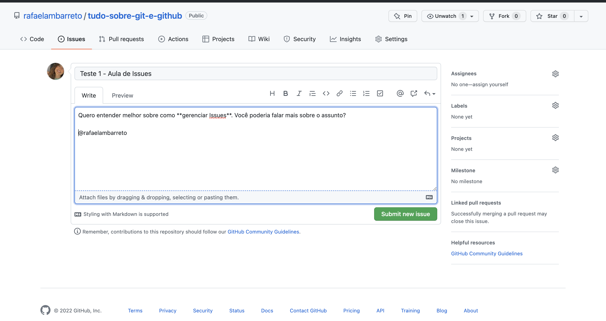

# **Tudo sobre Issues**

# **Índice**

## **[1. O que é uma Issue](#OqueéumaIssue)** 
## **[2. Formas de utilizar Issues](#formasdeutilizarissues)**
## **[3. Boas práticas](#BoasPráticas)** 

---

# **O que é uma Issue**

 Como o GitHub funciona também como uma rede social para programadores, ele possui formas de pessoas interagirem umas com as outras e a Issue é uma delas. 
 

 A palavra "Issue" vem do Inglês e significa problema ou questão. Ela nomeia a funcionalidade do GitHub que permite que usuários indiquem para outros que estão com problemas com um projeto, com dúvidas, problemas de usabilidade, que um código precisa ser revisto, entre muitas outras coisas. 

# **Como utilizar Issues** 

Existem alguns pontos de vista de utilização de Issues:

1. A **pessoa que gera Issues**, ou seja, a pessoa de fora que participa dos projetos por meio das Issues; 
2. A pessoa **gestora de Issues**, ou seja, quem recebe as Issues, responde e às resolve.

Veja abaixo o passo a passo de como utilizar a funcionalidade das duas formas:

## **Como pessoa que gera uma Issue**

1. Ao entrar em um repositório, você verá que existe uma aba `Issues` logo ao lado de `<> Code`. Como você pode ver abaixo: 

2. Para criar sua Issue, basta apertar no botão verde do lado esquerdo onde está escrito `New Issue` e uma tela, como a que você pode ver abaixo: 

3. Em **"Title"** você deve escrever o resumo do que é a sua Issue no campo abaixo de **"Write"**, escrever mais detalhes sobre ela. É importante saber que você **pode e deve** escrever em **Markdown** e ainda pode visualizar como o comentário irá ficar na aba **Preview**, assim como funciona o VSCode. 

    E, além disso, você também pode marcar pessoas utilizando o '@', assim como em uma rede social. 

4. Para finalizar e enviar a Issue, basta apertar no botão **"Submit new Issue"**. E, agora, é só esperar que alguém responda. 

5. 

# **Boas Práticas** 

1. Antes de abrir uma Issue, procure na lista de issues do projeto se já existe uma similar ao que você irá perguntar. Principalmente em projetos grandes, muito provavelmente já existe alguém que teve a mesma dúvida ou problema que você e já foi resolvido. 

Então você **evita** que a pessoa dona do repositório tenha que responder novamente, e também **resolve sua dúvida mais rapidamente.** 

