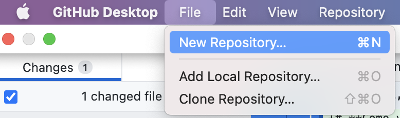
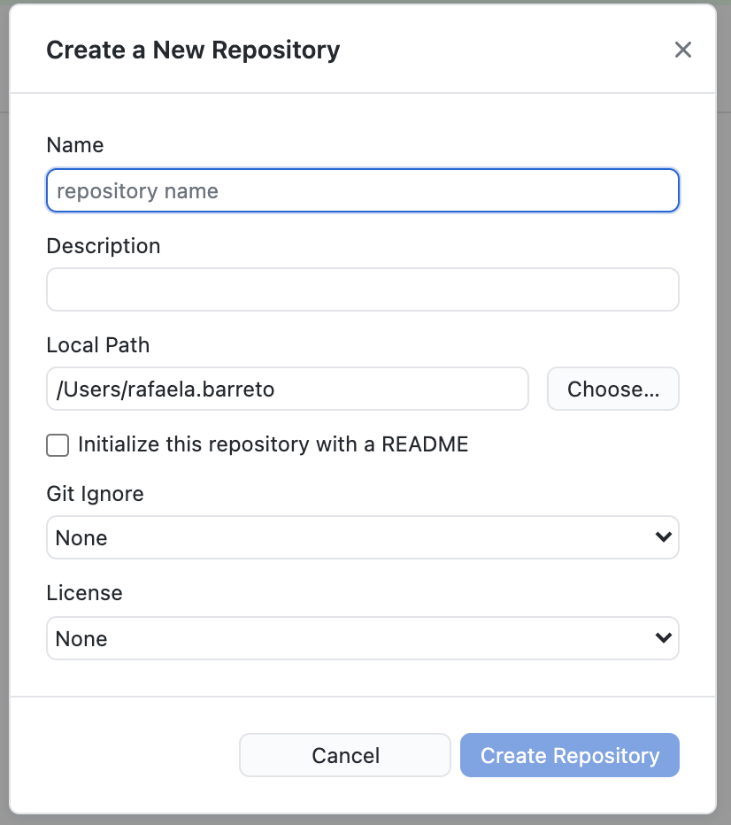
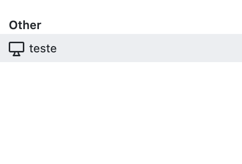
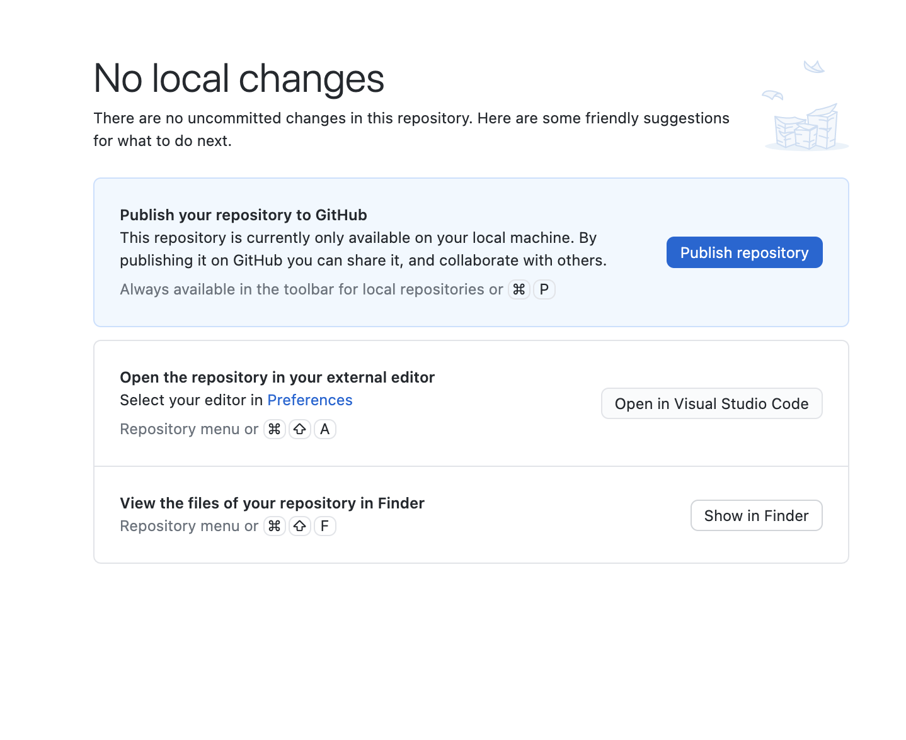
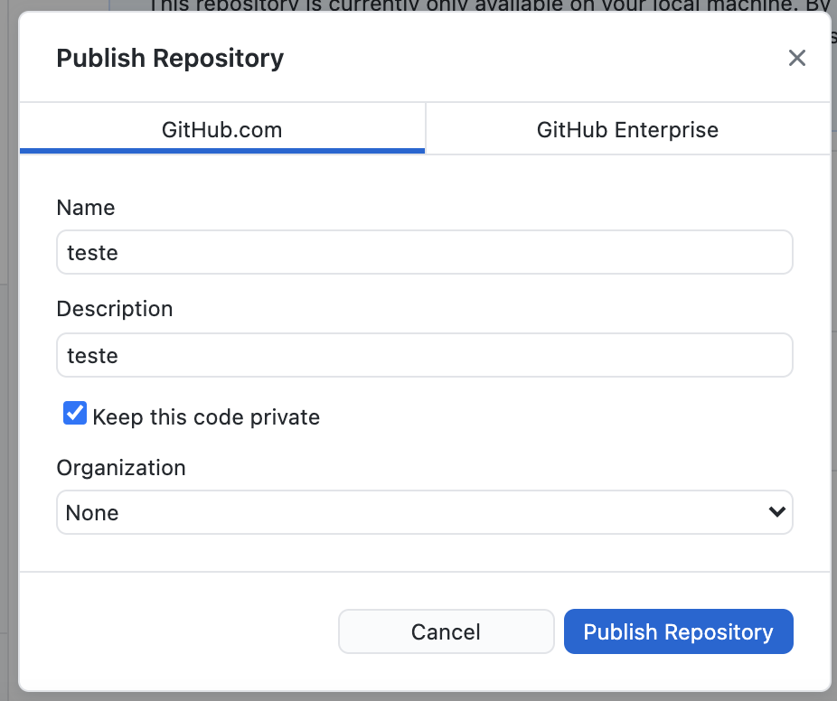

# **Como versionar projetos antigos**

# **Índice**

## **[1. Visão geral](#VisãoGeral)** 
## **[2. Passo a passo](#Passoapasso)** 
## **[3. Material de referência](#Materialdereferência)** 

---

# **Visão Geral** 

Às vezes, você já tinha algum projeto antigo na sua máquina local que não foi feito no GitHub. Mas, não se preocupe, aqui você aprende como versioná-los mesmo que eles já estejam prontos, basta seguir o passo a passo abaixo: 

-----

# **Passo a passo**

## **1. Abra seu GitHub Desktop** 

### 1.1. Vá ao menu e entre em **'file'** e depois clique em **'New Repository'** 

Afinal, antes de tudo, você deve criar um repositório para colocar o seu projeto. 

### 1.2. Ao clicar, uma janela irá aparecer requerindo os dados do novo repositório que você quer criar, entre eles estão 'Nome', 'Descrição', qual pasta você quer colocar ('Local Path'), entre outros, como você pode ver na imagem abaixo: 

#### **!! Importante Lembrar !!**

- Não esqueça de sempre **marcar a caixinha "Initialize this repository with a README"** ou, em PT-BR, "Inicializar este repositório com README". 

    Afinal, o README é essencial para explicar ao visitante do seu repositório o que tem lá dentro :wink:.

- Em **License** o Guanabara sempre indica marcar **MIT License** 

### 1.3. Depois de preencher, clique em **"Create Repository"**

Lembrando que, ao fazer isso, você está criando o repositório na sua máquina local, ou seja, no seu computador e não no repositório remoto. Para isso, você deve seguir o próximo passo :smiley:. 

### 1.4. Agora **publique** o seu novo repositório 

Você perceberá que na lista de repositórios no menu do canto direito, ele se encontrará embaixo do item 'Other', como na imagem abaixo:

Então, para publicar, você deve apertar em **'Publish Repository'**  (Publicar Repositório). E aí ele irá para o GitHub (seu repositório remoto). 

 

Depois de clicar, uma tela irá aparecer para você preencher os dados novamente de 'name' e 'description'. 

Além disso, também irá perguntar se você quer manter o código privado, ou seja, manter o repositório privado. Como, normalmente, os projetos aqui no GitHub são abertos, o Guanabara indica **desmarcar essa caixinha** que já vem marcada, como você pode ver abaixo: 

Em 'Organization', marque sua organização responsável, mas se for um projeto seu, é só deixar em 'None' mesmo. Depois de tudo estar certo, clique em **'Publish Repository'** novamente :wink:. 

Após você clicar, a Branch Principal será criada e você poderá visualizar seu novo repositório no GitHub! Mas, e agora? Como eu mando meus arquivos para lá? 

## **2. Vá ao seu gestor de arquivos (Explorer, Finder, etc.)** 

### 2.1. Faça o caminho que você criou para colocar a pasta do seu repositório local. 

Lembra do passo 1.2? Então, ali você definiu onde seu repositório local irá ficar. Vá até lá, abra esta pasta e você verá que só existirão dois arquivos: License (a pasta da sua licensa) e o README.md. 

### 2.2 Crie uma pasta para colocar os arquivos do seu projeto que estão no seu computador 

### 2.3 Copie e cole o seu projeto do seu computador, para a pasta que você criou no seu repositório local. 

A partir daí, todos os seus arquivos estarão dentro do seu **repositório local**. Você pode ver que, ao **ir ao seu Github Desktop**, ele já terá detectado várias alterações que precisam de commit local para depois receberem push. 

### 2.4 Ainda no GitHub Desktop, **antes de "commitar"**, verifique se existem arquivos que você não quer que estejam no seu repositório. Se sim, clique nele e selecione **"Ignore File (Add to .gitignore)"**

Assim, uma pasta chamda "Git Ignore" será criada com os arquivos que você não quer que sejam versionados localmente e enviados para o GitHub na hora do Push.

## **3. Pronto! Agora basta você fazer um commit e em seguida o push, da forma que foi ensinado em "Criando o primeiro repositório".** 

Assim, todos os seus arquivos do projeto estarão no GitHub e prontos para serem versionados e trabalhados por lá :smiley:. 

----

# **Material de Referência** 

Acesse à [aula online do Gustavo Guanabara no YouTube](https://youtu.be/065NQCDSMb0). 

