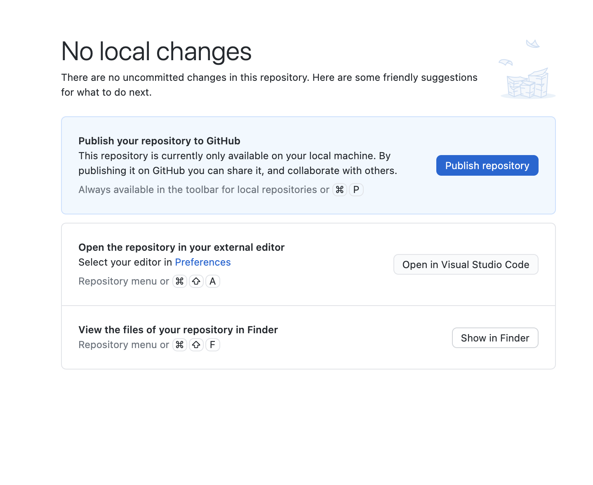
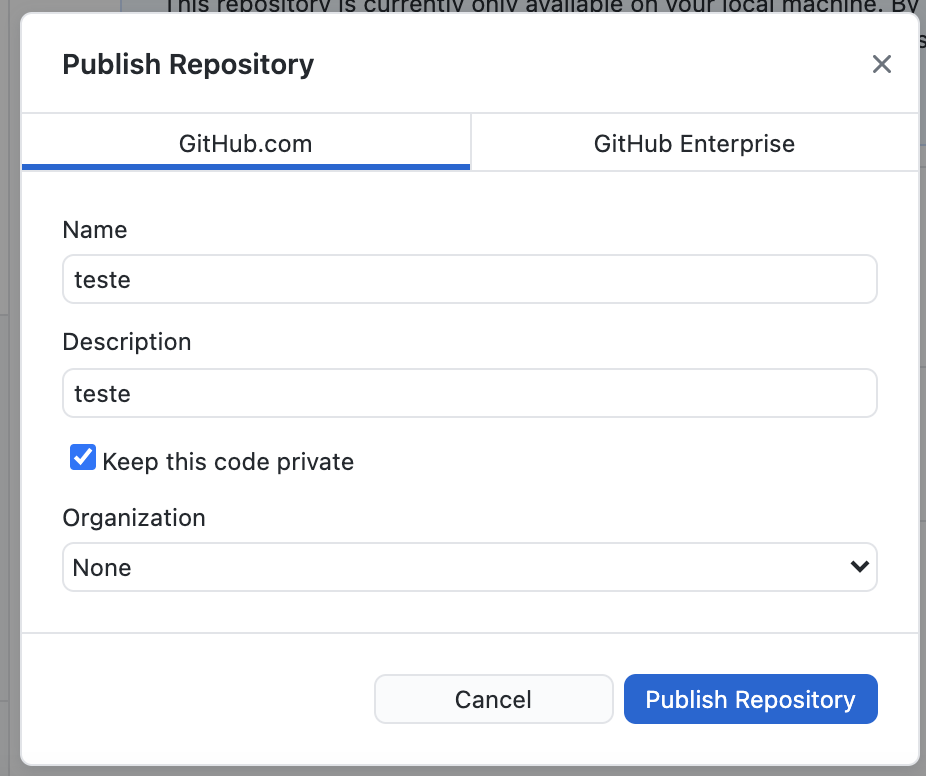

# **Como versionar projetos antigos**

Às vezes, você já tinha algum projeto antigo na sua máquina local que não foi feito no GitHub. Mas, não se preocupe, aqui você aprende como versioná-los mesmo que eles já estejam prontos, basta seguir o passo à passo abaixo: 

## **1. Abra seu GitHub Desktop** 

### a. Vá ao menu e entre em **'file'** e depois clique em **'New Repository'** 

### b. Uma janela irá aparecer requerindo os dados do novo repositório que você quer criar, entre eles estão 'Nome', 'Descrição', qual pasta você quer colocar ('Local Path'), entre outros, como você pode ver na imagem abaixo: 

#### **!! Importante Lembrar !!**

- Não esqueça de sempre **marcar a caixinha "Initialize this repository with a README"** ou, em PT-BR, "Inicializar este repositório com README". 

    Afinal, o README é essencial para explicar ao visitante do seu repositório o que tem lá dentro :wink:.

- Em **License** o Guanabara sempre indica marcar **MIT License** 

### c. Depois de preencher, clique em **"Create Repository"**

Lembrando que, ao fazer isso, você está criando o repositório na sua máquina local, ou seja, no seu computador e não no repositório remoto. Para isso, você deve seguir o próximo passo :smiley:. 

### d. Agora **publique** o seu novo repositório 

Você perceberá que na lista de repositórios no menu do canto direito, ele se encontrará embaixo do item 'Other', como na imagem abaixo:

Então, para publicar, você deve apertar em **'Publish Repository'**  (Publicar Repositório). E então ele irá para o GitHub (seu repositório remoto). 

 

Depois de clicar, uma tela irá aparecer para você preencher os dados novamente de 'name' e 'description'. Além disso, também irá perguntar se você quer manter o código privado, ou seja, manter o repositório privado. Como, normalmnete, os projetos aqui no GitHub são abertos, o Guanabara indica desmarcar essa caixinha que já vem marcada, como você pode ver abaixo: 

Em 'Organization', marque sua organização responsável, mas se for um projeto seu, é só deixar em 'None' mesmo. Depois de tudo estar certo, clique em **'Publish Repository'** novamente :wink:. 

