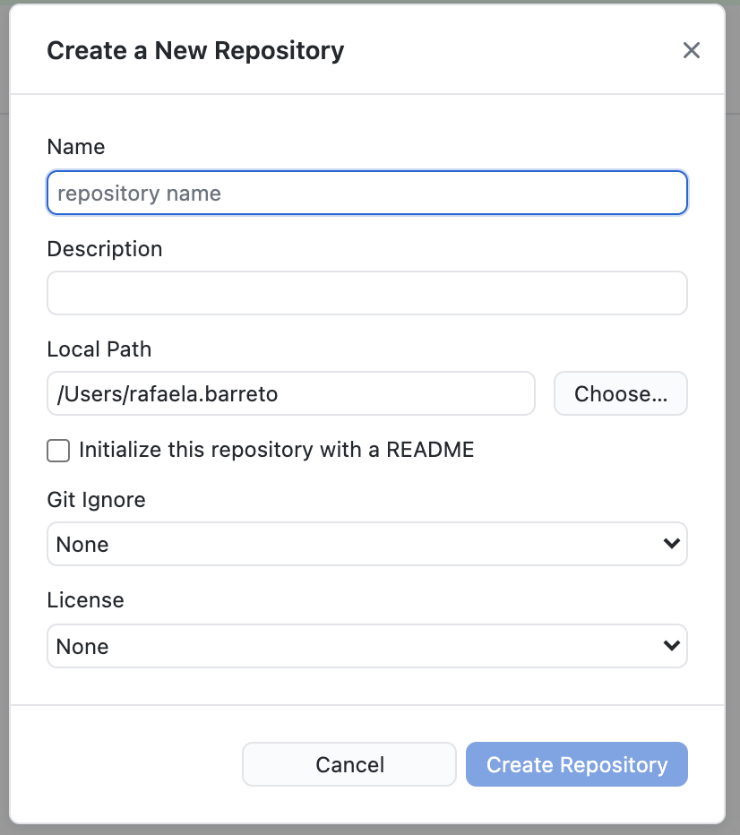

# **Como versionar projetos antigos**

Às vezes, você já tinha algum projeto antigo na sua máquina local que não foi feito no GitHub. Mas, não se preocupe, aqui você aprende como versioná-los mesmo que eles já estejam prontos, basta seguir o passo à passo abaixo: 

## **1. Abra seu GitHub Desktop** 

### a. Vá ao menu e entre em **'file'** e depois clique em **'New Repository'** 

### b. Uma janela irá aparecer requerindo os dados do novo repositório que você quer criar, entre eles estão 'Nome', 'Descrição', qual pasta você quer colocar ('Local Path'), entre outros, como você pode ver na imagem abaixo: 

#### **!! Importante Lembrar!!**

Não esqueça de sempre **marcar a caixinha "Initialize this repository with a README"** ou, em PT-BR, "Inicializar este repositório com README". 

Afinal, o README é essencial para explicar ao visitante do seu repositório o que tem lá dentro :wink:.

